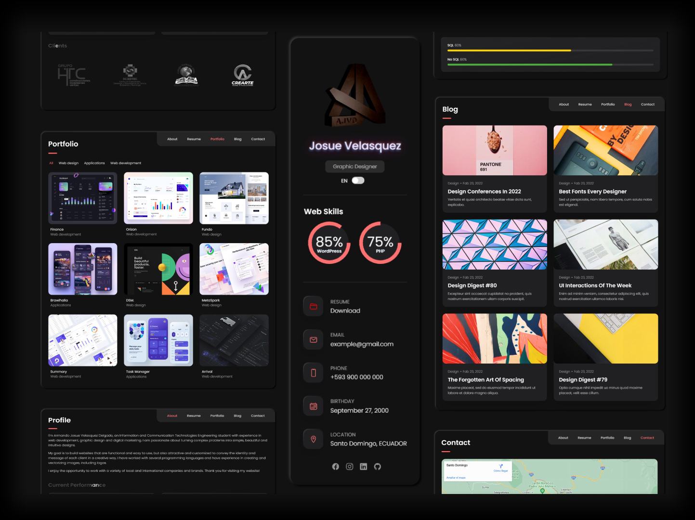
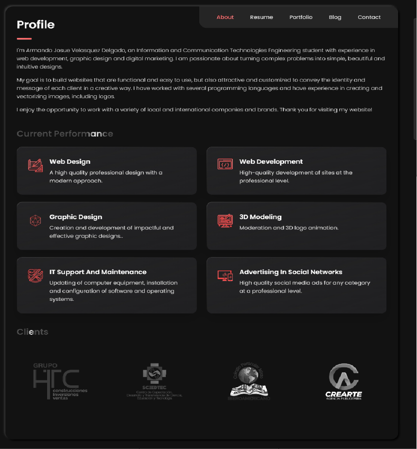
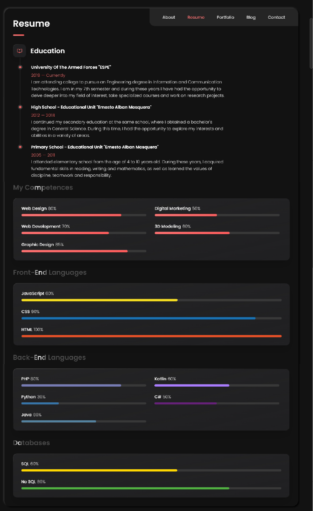
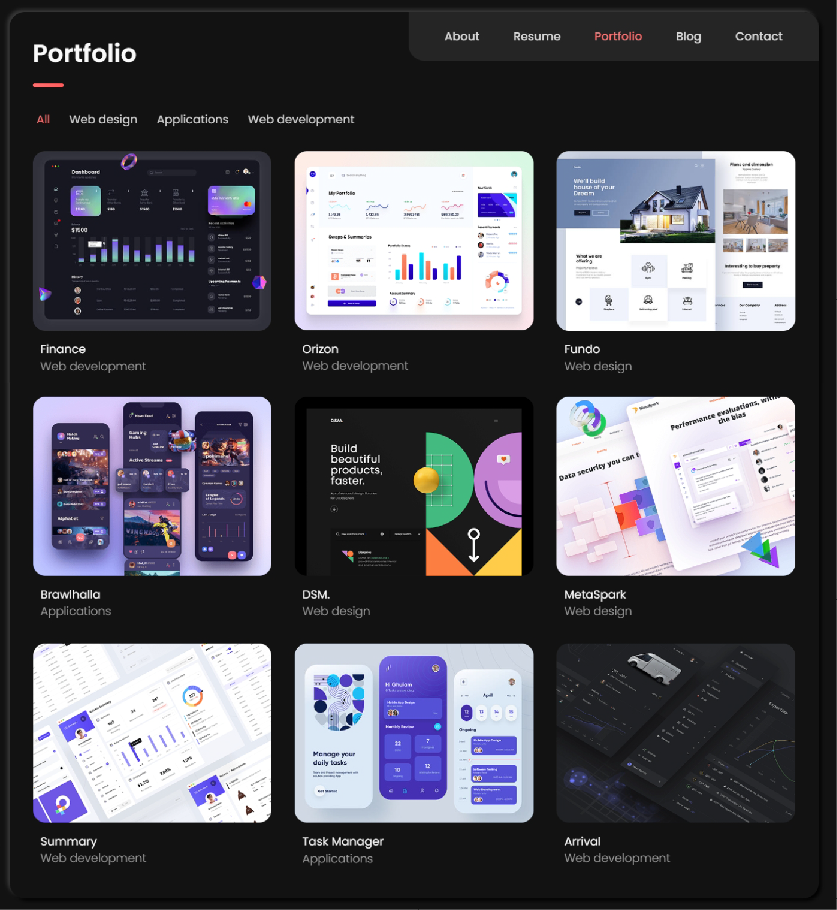
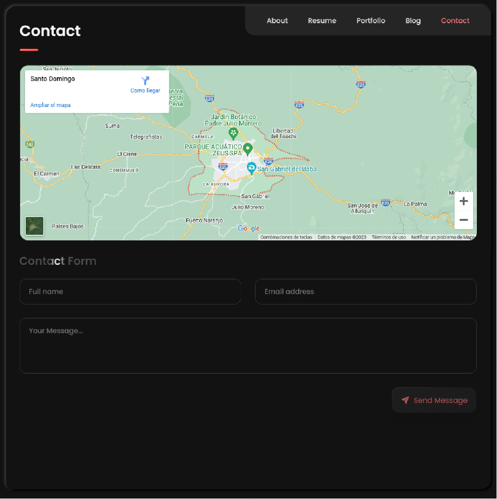

# Plantilla de Portafolio Web Elegante

## Descripción

La Plantilla de Portafolio Web Elegante es una herramienta diseñada para crear un portafolio personal en línea de aspecto elegante y profesional. Esta plantilla está desarrollada utilizando PHP, JavaScript y CSS puro, y es completamente receptiva, lo que significa que se verá y funcionará bien en una variedad de dispositivos y tamaños de pantalla.

## Características Principales

- Diseño elegante y moderno.
- Totalmente receptiva para una experiencia óptima en dispositivos móviles y de escritorio.
- Sección de inicio con información personal y una imagen destacada.
- Secciones para mostrar proyectos, habilidades y experiencia.
- Formulario de contacto para que los visitantes puedan ponerse en contacto contigo fácilmente.
- Personalizable y fácil de usar.

## Capturas de Pantalla

  
  
  
  
  

## Tecnologías Utilizadas

- PHP para la generación dinámica de contenido.
- JavaScript para la funcionalidad interactiva.
- CSS puro para el diseño y la presentación.

## Uso

1. Descarga la plantilla desde [URL_del_repositorio].
2. Personaliza el contenido en los archivos PHP y CSS según tus necesidades.
3. Carga la plantilla en tu servidor web o plataforma de alojamiento preferida.
4. Asegúrate de configurar el formulario de contacto para recibir mensajes de los visitantes.

## Personalización

Puedes personalizar la plantilla según tus necesidades editando los archivos PHP y CSS. Personaliza la información, los colores, las fuentes y más para que se adapten a tu estilo y contenido.

## Contribuir

Si deseas contribuir a esta plantilla, sigue los pasos:

1. Haz un fork del repositorio.

2. Crea una nueva rama para tu contribución: `git checkout -b tu-caracteristica`.

3. Realiza tus cambios y asegúrate de que las pruebas sean exitosas.

4. Envía una solicitud de extracción (Pull Request) con una descripción detallada de tus cambios.

## Licencia

Este proyecto está bajo la licencia [Licencia MIT](LICENSE).

## Créditos

- Modificado por `Armando Josue Velasquez Delgado`.
- Base del portfolio: `No se encontro el repositorio del autor principal`.
